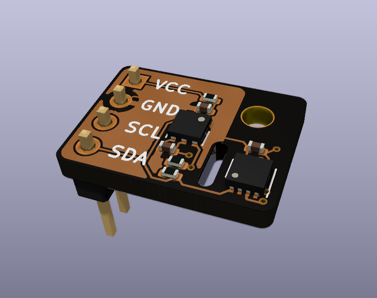
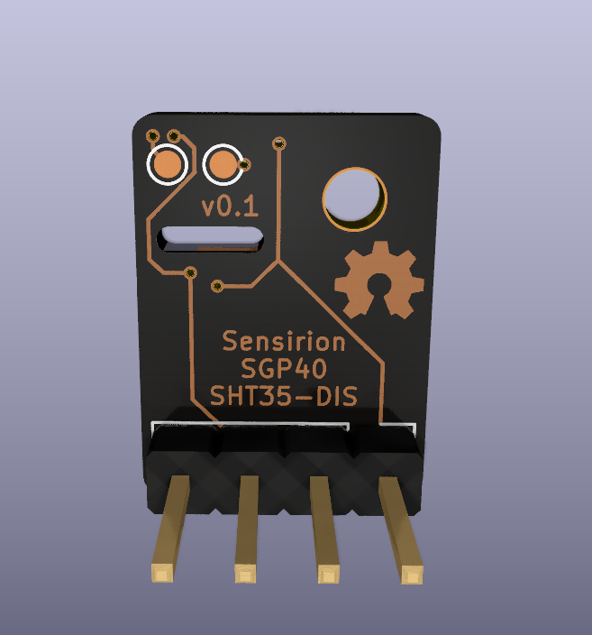

# SGP40 & SHT35-DIS Breakout Board

Simple Breakout Board for Sensirion SGP40 (VOC Sensor) and SHT35-DIS (Temperature
and Humidity Sensor). A PDF version of the schematic: [sgp40breakout.pdf](sgp40breakout.pdf).

Designed with KiCad.

